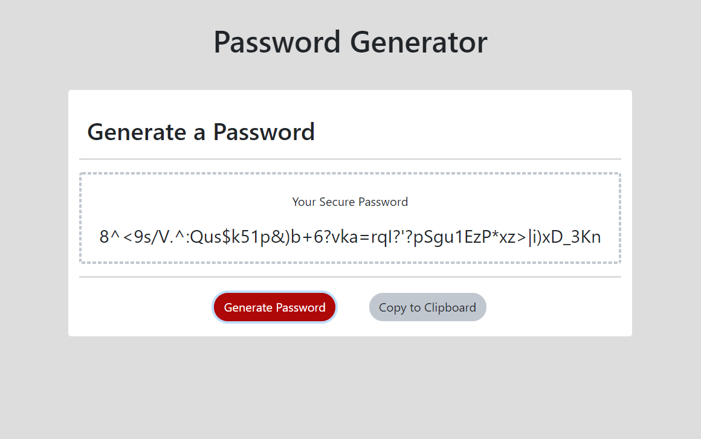

# HW3-Password-Generator
## Unit 03 JavaScript Homework: Password Generator

### Table of Contents
* General Info
* Files
* Technologies

### General Info
This is a password generator website.
The user is prompted to specify the password length and character types to be included in the password when clicking on the "Generate Pasword" button.
The user is able to copy the generated password to the clipboard when clicking on the "Copy to Clipboard" button.

Types of characters:
* [Special Characters](https://www.owasp.org/index.php/Password_special_characters)
* Numerical Characters
* Lowercase Characters
* Uppercase Characters

The generated password that meets user specified criteria is shown in the "Your Secure Password" area on the website.

### Link
[Click here to Generate Password](https://emi-dev.github.io/HW3-Password-Generator/)

### Files
* index.html
* style.css (under "assets/css")
* passwordGenerator.js (under "assets/js")
* README.md

### Technologies
Project is created with:
* JavaScript
* HTML 5
* CSS 3
* Bootstrap 4